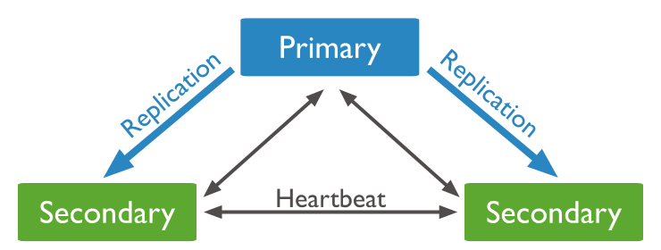
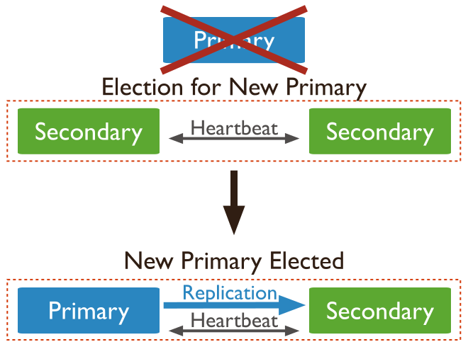

# MongoDB Replica Set by docker-compose

This source code was created for replica set and failover testing purposes.

## Quick Start
Just execute the command below.
```
docker-compose up -d
```

## Replication in MongoDB
A replica set is a group of mongod instances that maintain the same data set. A replica set contains several data bearing nodes and optionally one arbiter node. Of the data bearing nodes, one and only one member is deemed the primary node, while the other nodes are deemed secondary nodes.

### Relationship between Primary and Secondary


### Automatic Failover


## Docker services
The replica set consists of Primary, Secondary and Arbiter.

### Primary
mongodb-primary:27017

How to access from the command line
```
mongo -u root -p toor --port 27017
```
### Secondary
mongodb-secondary1:27018
How to access from the command line
```
mongo -u root -p toor --port 27018
```

mongodb-secondary2:27019
How to access from the command line
```
mongo -u root -p toor --port 27019
```

### Arbiter
It only votes to determine the Primary.
mongodb-arbiter:27020
How to access from the command line
```
mongo -u root -p toor --port 27019
```

## Internal/Membership Authentication
>You can require that members of replica sets and sharded clusters authenticate to each other. For the internal authentication of the members, MongoDB can use either keyfiles or x.509 certificates.
The selected method is used for all internal communication. For example, when a client authenticates to a mongos using one of the supported authentication mechanisms, the mongos then uses the configured internal authentication method to connect to the required mongod processes.


## Keyfiles
>Keyfiles use SCRAM challenge and response authentication mechanism where the keyfiles contain the shared password for the members.

## Use keyfile
```
--keyFile /etc/keyfile
```

## Generate new key file
```
openssl rand -base64 756 > <path-to-keyfile>
```
You can overwrite the keyfile.

